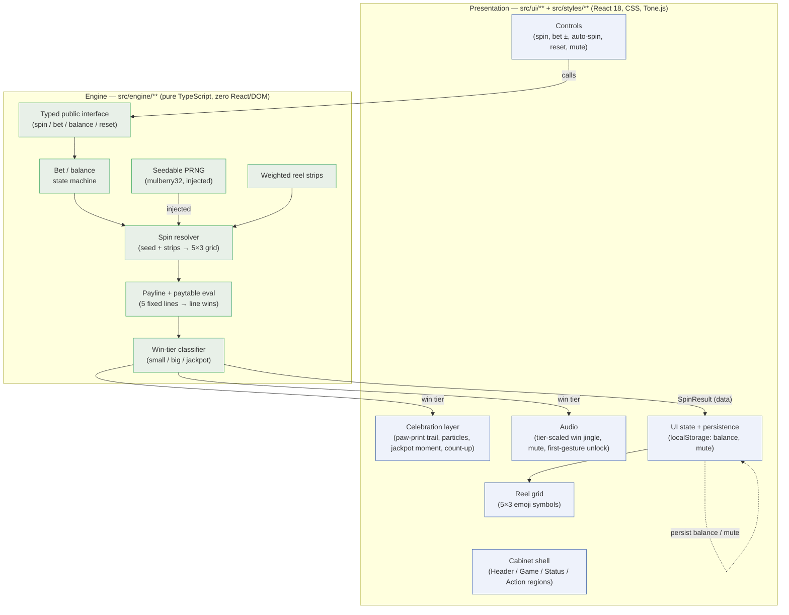
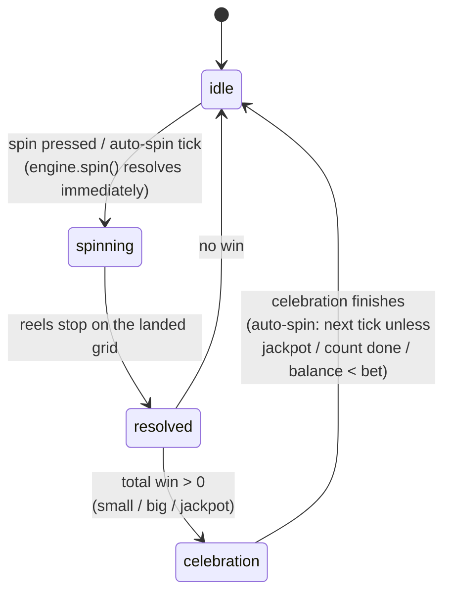

# Architecture

## Overview

Animal Slots is a static, client-only single-page web app: a play-money,
mobile-first 5×3 slot game. There is no backend, no accounts, and no network
calls at runtime. The whole app is two layers with one wall between them:

- **Engine** (`src/engine/**`) — pure TypeScript. All game logic: a seedable
  PRNG, weighted reel strips, spin resolution, payline + paytable evaluation,
  the bet/balance state machine, and win-tier classification. It imports **no**
  React and touches **no** DOM. Every random draw flows through an injected
  seed, so the engine is fully deterministic under test.
- **Presentation** (`src/ui/**`, `src/styles/**`) — React 18 + CSS. Renders the
  cabinet, reels, and controls; runs the spin/celebration animations (CSS
  transforms/keyframes); plays the synthesized win jingle (Tone.js). It owns all
  timing, animation, audio, and persistence; it consumes the engine only through
  the engine's typed public interface.

The wall between them is the project's central claim and is enforced
mechanically by an ESLint import-boundary rule (`engine-no-dom`) plus the
`no-restricted-imports` config, not just by convention. See `DEC-001`.

## Components



The only thing crossing the wall is a plain-data `SpinResult` (the resolved 5×3
grid, the list of winning lines and their payouts, the total win, the new
balance, and the win tier). The engine never hands back anything the UI must
animate; the UI decides how to render and time it.

## State Flow

The presentation layer is a small state machine. The engine has no notion of
time — a spin resolves instantly as data — so all of these states live in the
UI; they are how the UI *plays back* a single engine result.



- **idle** — cabinet at rest, awaiting input.
- **spinning** — reels animate; the engine result is already known, the UI is
  just playing the reel-stop choreography.
- **resolved** — reels have stopped on the real landed grid; the win (if any) is
  known from the `SpinResult`.
- **celebration** — small / big / jackpot feedback fires, scaled to the engine's
  win tier (paw-print trail, particles, balance count-up, wolf jackpot moment,
  tier-scaled jingle). The five "states" of the product spec map to
  idle, spinning, and the three celebration tiers.
- back to **idle** — or, under auto-spin, straight into the next spin unless a
  stop condition is met (jackpot hit, auto-count exhausted, or balance < bet).

## Module Layout

```
src/
├── engine/                 # pure TS, zero React/DOM (DEC-001, enforced by engine-no-dom)
│   ├── rng.ts              # mulberry32 seedable PRNG (DEC-002)
│   ├── strips.ts           # symbol set + weighted reel strips
│   ├── spin.ts             # seed + strips → 5×3 grid
│   ├── paylines.ts         # 5 fixed lines + paytable evaluation (DEC-003)
│   ├── balance.ts          # bet/balance state machine
│   ├── tiers.ts            # win-tier classification
│   └── index.ts            # typed public interface the UI consumes
├── ui/                     # React presentation
│   ├── App.tsx             # cabinet shell + UI state machine
│   ├── regions/            # Header / Game / Status / Action
│   ├── reels/              # reel grid + spin/stop animation
│   ├── controls/           # spin, bet ±, auto-spin, reset, mute
│   ├── celebration/        # paw-print trail, particles, jackpot moment, count-up
│   └── audio/              # Tone.js win jingle, mute, first-gesture unlock (DEC-007)
├── styles/
│   └── tokens.css          # design tokens: color, type scale, spacing (CSS custom properties)
└── main.tsx                # React mount
```

## Key Design Principles

- **Logic is separable from presentation, and it's enforced, not hoped for.**
  `src/engine/**` is pure and DOM-free; the boundary is a lint rule. (`DEC-001`)
- **Determinism via injected randomness.** One seedable PRNG, injected; no bare
  `Math.random()` in the engine. This is what makes spins testable. (`DEC-002`)
- **Play-money, no RTP claim.** Reel weights are tuned for feel, not a regulated
  payout. No real currency, ever. (`DEC-005`, constraint `no-real-money`)
- **The engine returns data; the UI owns time.** No animation or timing concept
  leaks into the engine.

## Boundaries and Interfaces

The single boundary is the engine's typed public interface (`src/engine/index.ts`).
The UI calls it to spin, change bet, read balance, and reset; it receives a
plain-data `SpinResult`. Nothing else crosses: the engine imports no UI code,
and the UI never reaches past the interface into engine internals.

## Data Flow

A spin: the player (or an auto-spin tick) triggers a control → the UI calls the
engine interface → the engine debits the bet, draws reel stops from the injected
RNG against the weighted strips, resolves the 5×3 grid, evaluates the five
paylines against the paytable, sums line wins, credits the balance, classifies
the win tier, and returns a `SpinResult` → the UI moves idle → spinning,
animates the reels to the landed grid (resolved), then fires the matching
celebration and jingle (celebration), and persists the new balance to
localStorage.

## Deployment Topology

Static SPA — a Vite build producing static assets. Runs entirely in the
browser; no server, database, or runtime network dependency. Optional future
deploy to GitHub Pages or Vercel is out of scope for the MVP unless trivial.

## References

- Decisions: `/decisions/` — especially `DEC-001` (separation), `DEC-002` (RNG),
  `DEC-003` (paylines), `DEC-004` (CSS animation), `DEC-005` (play-money),
  `DEC-006` (emoji symbols), `DEC-007` (synthesized audio), `DEC-011` (paytable +
  reel-strip weights).
- Constraints: `/guidance/constraints.yaml`
- Project brief & game-design spec: `/projects/PROJ-001-animal-slots/brief.md`
  (Game-Design Spec section — the authoritative paytable, weights, and rules)
- Data model / API contract: not applicable — no persistence schema beyond two
  localStorage keys (balance, mute) and no external API. See those docs'
  notes.
```
