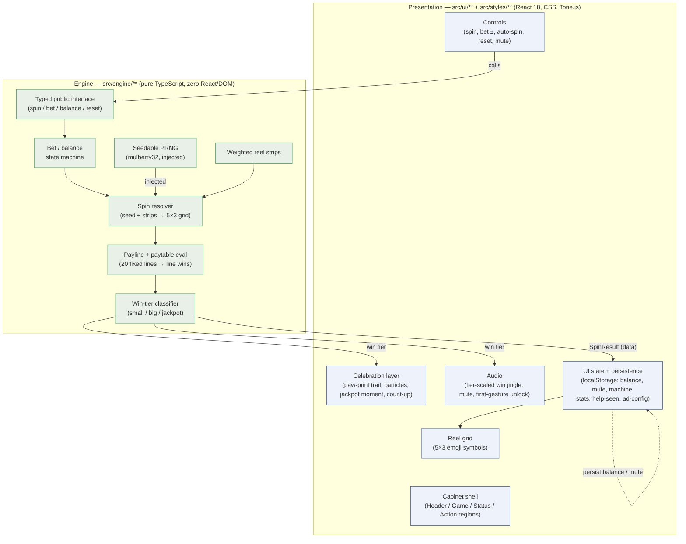
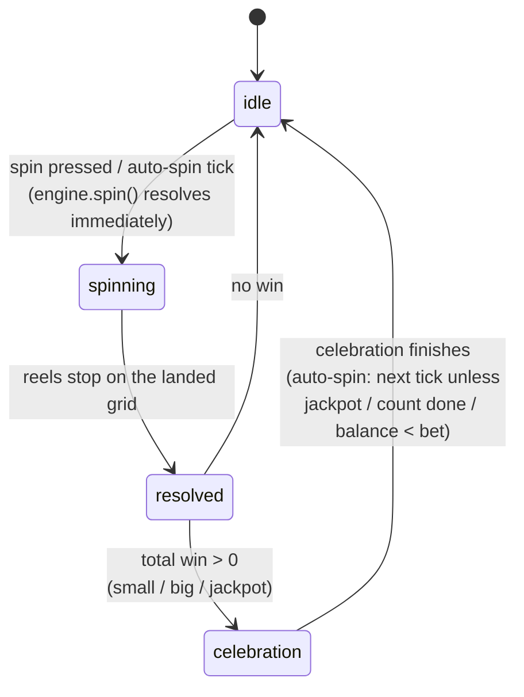

# Architecture

## Overview

Animal Slots is a static, client-only single-page web app: a play-money,
mobile-first 5×3 slot game across six themed machines. There is no backend, no
accounts, and no network calls at runtime. The whole app is three layers with
one wall between them:

- **Engine** (`src/engine/**`) — pure TypeScript. All game logic: a seedable
  PRNG, weighted reel strips, spin resolution, payline + paytable evaluation,
  the bet/balance state machine, and win-tier classification. It imports **no**
  React and touches **no** DOM. Every random draw flows through an injected
  seed, so the engine is fully deterministic under test.
- **Presentation** (`src/ui/**`, `src/styles/**`) — React 18 + CSS. Renders the
  cabinet, reels, and controls; runs the spin/celebration animations (CSS
  transforms/keyframes); plays the synthesized win jingle (Tone.js). It owns all
  timing, animation, audio, and persistence; it consumes the engine only through
  the engine's typed public interface.
- **Machines** (`src/machines/**`) — pure config data (DEC-015). Each machine is
  a `math` slice the engine consumes (symbols, weights, strips, paylines,
  paytable, jackpot rule, tier boundaries, bet levels) plus a `presentation`
  slice the engine never sees (emoji + labels, theme tokens, audio params).
  Adding a machine or retuning one is **data, not code** — no engine or UI
  change. Six are registered in `src/machines/registry.ts`.

The wall between them is the project's central claim and is enforced
mechanically by an ESLint import-boundary rule (`engine-no-dom`) plus the
`no-restricted-imports` config, not just by convention. See `DEC-001`.

## Components


```mermaid
graph TD
    subgraph Presentation["Presentation — src/ui/** + src/styles/** (React 18, CSS, Tone.js)"]
        Cabinet["Cabinet shell<br/>(Header / Game / Status / Action regions)"]
        Reels["Reel grid<br/>(5×3 emoji symbols)"]
        Controls["Controls<br/>(spin, bet ±, auto-spin, reset, mute)"]
        Celebrate["Celebration layer<br/>(paw-print trail, particles, jackpot moment, count-up)"]
        Audio["Audio<br/>(tier-scaled win jingle, mute, first-gesture unlock)"]
        Store["UI state + persistence<br/>(localStorage: balance, mute, machine,<br/>stats, help-seen, ad-config)"]
    end

    subgraph Engine["Engine — src/engine/** (pure TypeScript, zero React/DOM)"]
        RNG["Seedable PRNG<br/>(mulberry32, injected)"]
        Strips["Weighted reel strips"]
        Spin["Spin resolver<br/>(seed + strips → 5×3 grid)"]
        Eval["Payline + paytable eval<br/>(20 fixed lines → line wins)"]
        BetBal["Bet / balance<br/>state machine"]
        Tier["Win-tier classifier<br/>(small / big / jackpot)"]
        API["Typed public interface<br/>(spin / bet / balance / reset)"]
    end

    Controls -->|"calls"| API
    API --> BetBal
    BetBal --> Spin
    RNG -->|"injected"| Spin
    Strips --> Spin
    Spin --> Eval
    Eval --> Tier
    Tier -->|"SpinResult (data)"| Store
    Store --> Reels
    Tier -->|"win tier"| Celebrate
    Tier -->|"win tier"| Audio
    Store -. "persist balance / mute" .-> Store

    classDef engine fill:#e8f0e8,stroke:#4a6,stroke-width:1px;
    classDef pres fill:#eef2fb,stroke:#46a,stroke-width:1px;
    class RNG,Strips,Spin,Eval,BetBal,Tier,API engine;
    class Cabinet,Reels,Controls,Celebrate,Audio,Store pres;
```

The only thing crossing the wall is a plain-data `SpinResult` (the resolved 5×3
grid, the list of winning lines and their payouts, the total win, the new
balance, and the win tier). The engine never hands back anything the UI must
animate; the UI decides how to render and time it.

## State Flow

The presentation layer is a small state machine. The engine has no notion of
time — a spin resolves instantly as data — so all of these states live in the
UI; they are how the UI *plays back* a single engine result.


```mermaid
stateDiagram-v2
    [*] --> idle
    idle --> spinning: spin pressed / auto-spin tick<br/>(engine.spin() resolves immediately)
    spinning --> resolved: reels stop on the landed grid
    resolved --> celebration: total win > 0<br/>(small / big / jackpot)
    resolved --> idle: no win
    celebration --> idle: celebration finishes<br/>(auto-spin: next tick unless<br/>jackpot / count done / balance < bet)
```

- **idle** — cabinet at rest, awaiting input.
- **spinning** — reels animate; the engine result is already known, the UI is
  just playing the reel-stop choreography.
- **resolved** — reels have stopped on the real landed grid; the win (if any) is
  known from the `SpinResult`.
- **celebration** — small / big / jackpot feedback fires, scaled to the engine's
  win tier (paw-print trail, particles, balance count-up, wolf jackpot moment,
  tier-scaled jingle). The five "states" of the product spec map to
  idle, spinning, and the three celebration tiers.
- back to **idle** — or, under auto-spin, straight into the next spin unless a
  stop condition is met (jackpot hit, auto-count exhausted, or balance < bet).

## Module Layout

```
src/
├── engine/                 # pure TS, zero React/DOM (DEC-001, enforced by engine-no-dom)
│   ├── rng.ts              # mulberry32 seedable PRNG (DEC-002)
│   ├── strips.ts           # symbol set + weighted reel strips
│   ├── stripBuilder.ts     # weights → deterministic strip (DEC-016)
│   ├── spin.ts             # seed + strips → 5×3 grid
│   ├── paylines.ts         # 20 fixed lines + paytable evaluation (DEC-003, widened by DEC-016)
│   ├── balance.ts          # bet/balance state machine
│   ├── tiers.ts            # win-tier classification
│   ├── machine.ts          # the MachineMath slice a machine supplies (DEC-015)
│   ├── metrics.ts          # RTP / hit-frequency simulation (drives `just simulate`)
│   └── index.ts            # typed public interface the UI consumes
├── machines/               # the six machines as pure config data (DEC-015)
│   ├── types.ts            # Machine = math slice + presentation slice
│   ├── registry.ts         # registration + active-machine resolution
│   ├── wildAndWhimsical.ts # the default machine (DEC-016 retune)
│   ├── arctic.ts · desert.ts · ocean.ts · farm.ts · diner.ts   # DEC-017/018/019/026/027
│   └── activeMachineStorage.ts
├── ui/                     # React presentation — owns time, animation, audio, persistence
│   ├── App.tsx             # cabinet shell + UI state machine
│   ├── useSlotMachine.ts   # the spin flow hook (engine calls, auto-spin, celebration timing)
│   ├── JackpotMoment.tsx · useCountUp.ts · PaylineMap.tsx · PaytableSheet.tsx
│   ├── regions/            # Header / Game / Status / Action
│   ├── reels/              # reel grid + spin/stop animation
│   ├── audio/              # Tone.js engine, mixer, jingle, sfx, mute (DEC-007, DEC-013)
│   ├── machine/            # machine provider + switcher
│   ├── theme/              # per-machine CSS-custom-property theming
│   ├── stats/              # sparkline + stats sheet
│   ├── trophies/           # trophy case (derived from session stats, DEC-024)
│   ├── help/               # first-run explainer (DEC-022)
│   ├── ads/                # first-party fake-ad probe — no ad network, no real money
│   └── analytics/          # provider wiring for the default-OFF seam
├── stats/                  # session-stats model + versioned storage (DEC-020)
├── analytics/              # usage-analytics seam — OFF by default, DNT-honoring (DEC-023)
├── deploy/                 # contract tests for _headers, favicon, security.txt
├── styles/
│   ├── tokens.css          # design tokens: color, type scale, spacing (CSS custom properties)
│   ├── reset.css
│   └── reduced-motion.css
└── main.tsx                # React mount
```

## Key Design Principles

- **Logic is separable from presentation, and it's enforced, not hoped for.**
  `src/engine/**` is pure and DOM-free; the boundary is a lint rule. (`DEC-001`)
- **Determinism via injected randomness.** One seedable PRNG, injected; no bare
  `Math.random()` in the engine. This is what makes spins testable. (`DEC-002`)
- **Play-money, no RTP claim.** Reel weights are tuned for feel, not a regulated
  payout. No real currency, ever. (`DEC-005`, constraint `no-real-money`)
- **The engine returns data; the UI owns time.** No animation or timing concept
  leaks into the engine.
- **A machine is config, not code.** Adding a variant or retuning math is a data
  change under `src/machines/` plus a line in `registry.ts` — the engine and UI
  are untouched. (`DEC-015`)

## Boundaries and Interfaces

The single boundary is the engine's typed public interface (`src/engine/index.ts`).
The UI calls it to spin, change bet, read balance, and reset; it receives a
plain-data `SpinResult`. Nothing else crosses: the engine imports no UI code,
and the UI never reaches past the interface into engine internals.

## Data Flow

A spin: the player (or an auto-spin tick) triggers a control → the UI calls the
engine interface → the engine debits the bet, draws reel stops from the injected
RNG against the weighted strips, resolves the 5×3 grid, evaluates the twenty
paylines against the paytable, sums line wins, credits the balance, classifies
the win tier, and returns a `SpinResult` → the UI moves idle → spinning,
animates the reels to the landed grid (resolved), then fires the matching
celebration and jingle (celebration), and persists the new balance to
localStorage.

## Deployment Topology

Static SPA — a Vite build producing static assets. Runs entirely in the
browser; no server, database, or runtime network dependency. Deployed to
**Cloudflare Workers Static Assets** via `wrangler deploy` against
`wrangler.jsonc`, which uploads `./dist` with SPA fallback routing (DEC-014,
superseding DEC-008's Pages choice). Response headers (CSP etc.) ship via
`public/_headers`; HSTS is set at the Cloudflare zone/edge.

## References

- Decisions: `/decisions/` — especially `DEC-001` (separation), `DEC-002` (RNG),
  `DEC-003` (paylines) and `DEC-016` (the retune that widened them to 20),
  `DEC-004` (CSS animation), `DEC-005` (play-money), `DEC-006` (emoji symbols),
  `DEC-007` (synthesized audio), `DEC-011` (paytable + reel-strip weights),
  `DEC-015` (config-driven machine model), `DEC-014` (Workers Static Assets
  deploy).
- Constraints: `/guidance/constraints.yaml`
- Project brief & game-design spec: `/projects/PROJ-001-animal-slots/brief.md`
  (Game-Design Spec section). Note this records the **MVP** rules; the live
  paytable, weights, and payline set were retuned by DEC-016 and now live
  per-machine under `src/machines/`. The code is authoritative.
- Data model / API contract: no external API, and no persistence schema beyond
  a handful of localStorage keys — see `data-model.md` for the current list.
