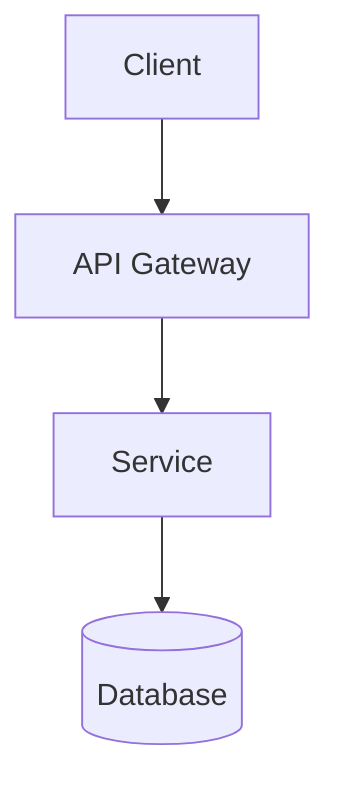

# Architecture

> Replace this placeholder with your actual architecture doc. Have Claude
> populate it during the PROJECT DESIGN prompt (Prompt 2a).

## Overview

[REPLACE: One-paragraph description of what this system does and why.]

## Components

[REPLACE: List the main components, their responsibilities, and how they
communicate. A Mermaid diagram is useful here.]

## Key Design Principles

[REPLACE: The guiding principles that anchor all architectural decisions.
These should be concrete, not platitudes. Link to the DEC-* that
formalize each.]

## Boundaries and Interfaces

[REPLACE: Where the major boundaries are and what crosses them.]

## Data Flow

[REPLACE: How a typical request/event moves through the system.]

## Deployment Topology

[REPLACE: Where each component runs, how it scales.]

## References

- Data model: `./data-model.md`
- API contract: `./api-contract.md`
- Decisions: `/decisions/`
