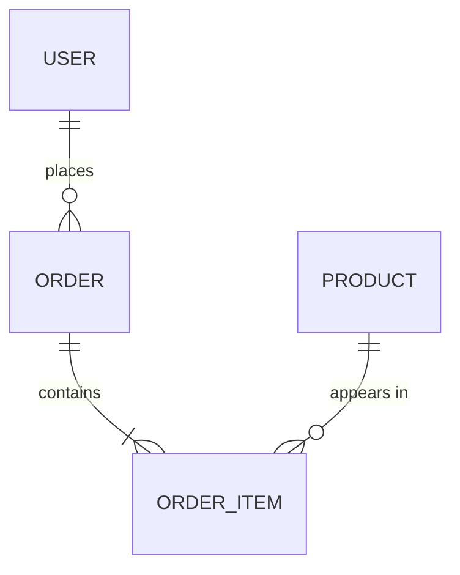

# Data Model

> Replace this placeholder with your actual data model. If your project
> has no persistent data, delete this file.

## Entities

[REPLACE: List the main entities, their fields, and their relationships.
The Mermaid ER diagram below renders on GitHub — keep it in sync with the
tables as the model evolves.]

### Entity: [Name]

| Field | Type | Nullable | Description |
|---|---|---|---|
| id | uuid | no | Primary key |
| ... | ... | ... | ... |

**Relationships:**
- ...

## Schema Evolution

[REPLACE: How migrations are handled, versioning strategy, backward
compatibility rules.]

## Indexes

[REPLACE: Non-obvious indexes and why they exist.]

## Data Lifecycle

[REPLACE: How data is created, updated, archived, deleted. Retention
policies.]
